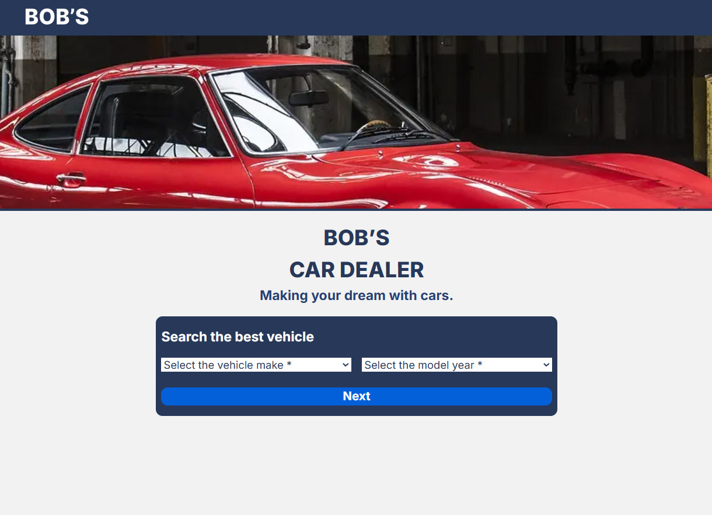

# Bob’s car dealer

 This is a website that have the objective to search for vehicle models with the year of then.

## Content

- [About](#About)
  - [Screenshot](#Screenshot)
  - [Features](#Features)
  - [Architecture](#Architecture)
  - [Environment](#Environment)
  - [Instructions](#Instructions)
  - [Links](#Links)
  - [Technologies](#Technologies)

## About

### Screenshot



### Features

- Can search by model and year of the vehicle.
- Have loading pages.
- Show all the model by the year you selected, in a simple page.
- Responsive design.

### Architecture

- The pages are in the app folder in src, and have a Architecture like a url of the website.
- It has a components folder in the src.
- It has a public folder that contains the images folder (with a svg folder), and the preview folder.
- In the root of the project, there are files with configurations like tailwind.config.ts.

### Environment

Listed variables in .env.local
- NEXT_PUBLIC_API_ROUTE=https://vpic.nhtsa.dot.gov/api/vehicles

### Instructions

1: Download the project using the green code button in the project repository, then selecting the format you want, for example zip.

2: Open with Vscode or any other.

3: Put the following commands in the Vscode terminal:

```bash
npm install
# or
yarn install
# or
pnpm install
# or
bun install
```

4: After that, run the development server:

```bash
npm run dev
# or
yarn dev
# or
pnpm dev
# or
bun dev
```

5: Open [http://localhost:3000](http://localhost:3000) with your browser to see the result.

### Links

- Preview URL: [click here](https://bob-car-dealer.vercel.app/).

- Figma Design: [click here](https://www.figma.com/design/kXWxgIgNvyTrPiVUZj0g15/Car-dealer-app?t=1oAyj9vGHSGkIIbF-1).

### Technologies

- Next.Js
- Typescript
- ESLint and Prettier
- Tailwind CSS